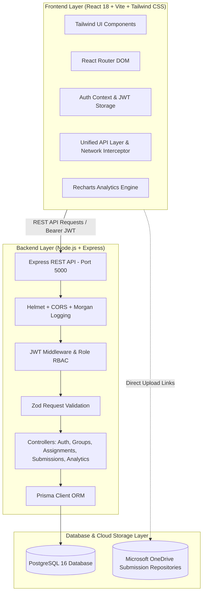
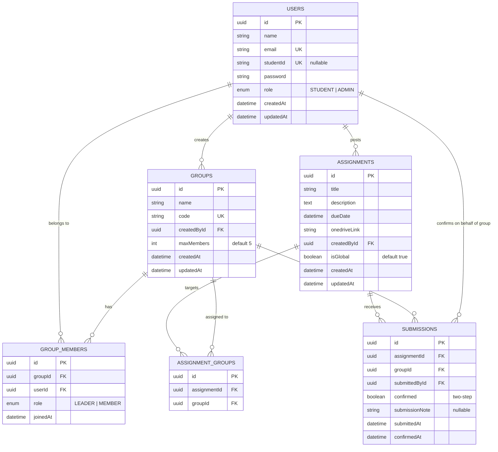

# JoinEazy — Student, Group & Assignment Management System

A role-based, full-stack collaborative educational platform built for **Joineazy**. Students self-organize into groups, invite peers, access assignment briefs and OneDrive submission folders, and verify their submissions via a **two-step confirmation workflow**. Professors manage assignments, target specific groups, and track cohort progress through real-time analytics dashboards.

---

## 🌟 Key Features

### 🧑‍🎓 Student Portal
- **Self-Service Group Formation:** Create groups with custom member limits (default 5 students). Group creators are automatically assigned as `LEADER`.
- **Member Invitations:** Invite classmates using their university **email** or unique **Student ID** with instant duplicate and capacity validation. Single-group constraint is strictly enforced.
- **Assignments & OneDrive Repositories:** Browse active and past coursework with direct launch links to OneDrive submission folders.
- **Two-Step Submission Verification:**
  - **Step 1:** Verify external OneDrive file upload, attach optional notes or submission links, and click *"Yes, I have submitted"*.
  - **Step 2:** Final confirmation commit locking in the submission timestamp on behalf of the group.
- **Visual Progress & Milestones:** Real-time animated progress bars and achievement badges (*"First Submission"*, *"Halfway Milestone"*, *"100% Perfection"*).

### 🎓 Professor (Admin) Portal
- **Assignment Authoring & Group Targeting:** Post assignments with rich descriptions, due dates, OneDrive URLs, and configurable targeting (**Assign to All Groups** or **Select Specific Groups**).
- **Unified Submission Tracker:** Group-wise and student-wise audit logs displaying submission confirmation timestamps, submitter identities, student notes, and roster participation.
- **Cohort Analytics & Visual Charts:**
  - Interactive Recharts bar graphs comparing submitted vs. pending groups across assignments.
  - Group performance comparison charts.
  - KPI summary counters (Assignments, Groups, Students, Submissions, Global Completion %).
  - Real-time submission activity feed.

### ⚡ Developer & Evaluator Experience
- **1-Click Persona Switcher:** Built directly into the navigation bar and login screen to seamlessly switch between Professor (`Dr. Evelyn Reed`), Student Leader (`Alex Chen`), and Unassigned Student (`Emily Zhang`) with zero friction.
- **Resilient Dual-Mode API Client:** Transparent fallback to persistent offline store when running in frontend-only development mode, and native Axios REST calls against the PostgreSQL Express server.

---

## 🏗️ Architecture Overview



---

## 🗄️ Database Schema & Entity Relationships



### Relational Constraints:
- `group_members`: Unique composite constraint `@@unique([groupId, userId])` ensures no student is duplicated within a group.
- `submissions`: Unique composite constraint `@@unique([assignmentId, groupId])` guarantees a single canonical submission record per group per assignment.
- Single group constraint: Express controller validates that a student cannot create or join multiple active groups simultaneously.

---

## 🚀 Quick Setup & Run Instructions

### Option 1: Full-Stack Containerization with Docker Compose (Recommended)

Spins up PostgreSQL 16, Node.js Express backend, and React Nginx frontend with a single command:

```bash
# 1. Clone repository
git clone <your-repo-url>
cd JoinEazy

# 2. Start all containers
docker-compose up --build
```

- **Frontend Application:** `http://localhost:3000` (or `http://localhost:5173` for Vite dev)
- **Backend API:** `http://localhost:5000`
- **PostgreSQL Database:** `localhost:5432`

---

### Option 2: Local Development Setup

#### Prerequisites:
- Node.js (v18+ or v20+ LTS recommended)
- PostgreSQL (v15+ or v16+)

#### 1. Backend Setup (`server/`):
```bash
cd server
npm install

# Configure environment
cp .env.example .env

# Run database migration & generate Prisma Client
npx prisma db push
npx prisma generate

# Seed sample database data (Professor, Students, Groups, Assignments)
npm run prisma:seed

# Start backend dev server
npm run dev
```
Backend runs on `http://localhost:5000`.

#### 2. Frontend Setup (`client/`):
```bash
cd client
npm install

# Start Vite React development server
npm run dev
```
Frontend runs on `http://localhost:5173`.

---

## 🔑 Pre-Configured Demo Accounts

| Role | Name | Email | Password | Group Affiliation |
|------|------|-------|----------|-------------------|
| **Professor (Admin)** | Dr. Evelyn Reed | `professor@joineazy.edu` | `password123` | Cohort Overseer |
| **Student (Leader)** | Alex Chen | `alex@joineazy.edu` | `password123` | Quantum Coders (Leader) |
| **Student (Member)** | Maria Rodriguez | `maria@joineazy.edu` | `password123` | Quantum Coders (Member) |
| **Student (Leader)** | Sarah Connor | `sarah@joineazy.edu` | `password123` | Nexus Innovators (Leader) |
| **Student (Unassigned)** | Emily Zhang | `emily@joineazy.edu` | `password123` | *No group (ready to invite/create)* |

*Tip: You can also use the **"Switch Persona"** menu in the top navigation bar or the 1-click buttons on the Login page.*

---

## 📡 REST API Endpoint Details

All protected endpoints require the HTTP header: `Authorization: Bearer <JWT_TOKEN>`.

### Authentication Endpoints (`/api/v1/auth`)
| Method | Endpoint | Auth | Description |
|--------|----------|------|-------------|
| `POST` | `/api/v1/auth/register` | Public | Register a new user (`STUDENT` or `ADMIN`) with email and password |
| `POST` | `/api/v1/auth/login` | Public | Authenticate user credentials and receive JWT |
| `GET` | `/api/v1/auth/me` | User | Get profile and group memberships of logged-in user |
| `GET` | `/api/v1/auth/students` | User | Search students by name, email, or student ID |

### Group Management Endpoints (`/api/v1/groups`)
| Method | Endpoint | Auth | Description |
|--------|----------|------|-------------|
| `POST` | `/api/v1/groups` | Student | Create a new group (creator automatically becomes `LEADER`) |
| `GET` | `/api/v1/groups/my-group` | Student | Get current user's group, roster, and submission history |
| `GET` | `/api/v1/groups` | User | List all active student groups in cohort |
| `GET` | `/api/v1/groups/:id` | User | Get details of a specific group by ID |
| `POST` | `/api/v1/groups/:id/members` | Member/Admin | Add student to group via email or student ID (enforces capacity) |
| `DELETE` | `/api/v1/groups/:id/members/:userId` | Leader/Admin | Remove a member or leave group |

### Assignment Endpoints (`/api/v1/assignments`)
| Method | Endpoint | Auth | Description |
|--------|----------|------|-------------|
| `GET` | `/api/v1/assignments` | User | Get all assignments applicable to user (filtered by group for students) |
| `GET` | `/api/v1/assignments/:id` | User | Get single assignment details and group submission status |
| `POST` | `/api/v1/assignments` | Admin | Create assignment with title, description, due date, OneDrive link, and targeting |
| `PUT` | `/api/v1/assignments/:id` | Admin | Edit assignment details, deadlines, and targeted groups |
| `DELETE` | `/api/v1/assignments/:id` | Admin | Delete assignment and associated submission records |

### Submission & Two-Step Verification Endpoints (`/api/v1/submissions`)
| Method | Endpoint | Auth | Description |
|--------|----------|------|-------------|
| `POST` | `/api/v1/submissions/confirm` | Student | **Two-step submission confirmation** (`confirmed: true`, `submissionNote`) |
| `GET` | `/api/v1/submissions/my-group` | Student | Get all submissions made by student's group with completion % |
| `GET` | `/api/v1/submissions/assignment/:id` | Admin | Track group-wise and student-wise submission logs for an assignment |

### Analytics Endpoints (`/api/v1/analytics`)
| Method | Endpoint | Auth | Description |
|--------|----------|------|-------------|
| `GET` | `/api/v1/analytics/dashboard` | Admin | Cohort KPIs, assignment completion breakdown, and group progress rates |

---

## 🎨 Key Design & Engineering Decisions

1. **Two-Step Submission Verification Workflow:**
   - *Problem:* Assignments are uploaded to external OneDrive folders, so direct file ingestion cannot be captured on our server.
   - *Solution:* A designated 2-step verification modal. Step 1 launches the OneDrive directory and captures optional student notes. Step 2 requires an explicit confirmation commit (*"Yes, I have submitted"*), stamping the submission with the student's ID, group ID, and exact timestamp.
2. **Selective vs. Global Assignment Scope:**
   - Professors can toggle between assigning coursework globally to all students/groups or selectively to specific groups (e.g., Honors Track or specialized project tracks).
3. **Capacity Constraints & Single-Group Invariant:**
   - Students cannot belong to multiple groups simultaneously, preventing split submission records or grade ambiguity.
   - Group max capacity is configurable upon group creation (default 5) and strictly validated server-side.
4. **Resilient Dual-Mode API Layer:**
   - The React client contains an Axios instance configured with Bearer token interceptors, with an intelligent localStorage mock fallback for offline or frontend-only demonstration environments.
5. **Modern Design Aesthetics:**
   - Google Fonts (`Inter`), curated indigo/slate palette, glassmorphic cards, micro-animations, accessible modals, and Recharts interactive visualizations.

---

## 📄 Submission Details
- **Role:** Full Stack Intern
- **Company:** JoinEazy
- **Assignment:** Task 1 — Full Stack: Student, Group & Assignment Management System
