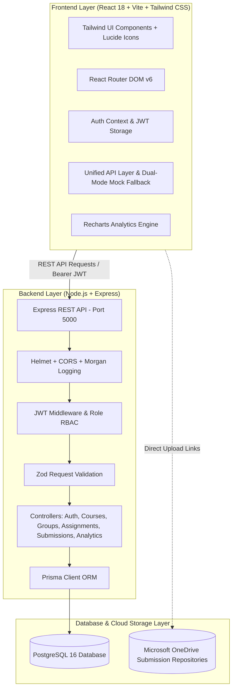

# JoinEazy — Student, Group, Course & Assignment Management System

A role-based, full-stack collaborative educational platform built for **JoinEazy** (Task 1 & Task 2). Students enroll in courses, self-organize into groups, invite peers, access assignment briefs and OneDrive submission folders, and verify their submissions via a **two-step confirmation workflow**. Professors organize coursework by course, configure group vs. individual submissions, target specific student cohorts, and track progress through real-time analytics dashboards.

---

## 🌟 Key Features

### 🧑‍🎓 Student Portal
- **Enrolled Course Hub:** Interactive course cards displaying enrolled courses, instructor details, assignment tallies, and completion progress bars. Click any course to launch its dedicated coursework portal.
- **Self-Service Group Formation:** Create groups with configurable member limits (default 5 students). Group creators are automatically assigned as `LEADER`.
- **Member Invitations:** Invite classmates using their university **email** or unique **Student ID** with instant duplicate and capacity validation. Single-group constraint is strictly enforced.
- **Assignments & OneDrive Repositories:** Browse active and past coursework with live countdown timers, status badges (`Awaiting Submission`, `Submitted`, `Overdue`), and direct launch links to OneDrive submission folders.
- **Two-Step Submission Verification:**
  - **Individual & Group Modes:** Supports individual assignments (any enrolled student confirms) and group projects (with leader-only acknowledgment enforcement).
  - **Step 1:** Review submission guidelines, open external OneDrive directory, and attach optional submission notes/links.
  - **Step 2:** Explicit confirmation commit locking in the submission timestamp.
  - **Step 3:** Animated success confirmation state with smooth visual feedback.
- **Visual Progress & Milestones:** Real-time animated progress bars and achievement badges (*"First Submission"*, *"Halfway Milestone"*, *"100% Perfection"*, *"On Fire"*, *"Early Bird"*).

### 🎓 Professor (Admin) Portal
- **Curriculum & Course Management:** Create, update, and manage courses with course codes (e.g., `CS301`), titles, descriptions, and view student cohort enrollments.
- **Assignment Authoring & Scoping:** Post coursework with rich descriptions, due dates, OneDrive URLs, course association, and configurable targeting (**Assign to All Groups**, **Specific Groups**, or **Individual**).
- **Unified Submission Tracker:** Group-wise and student-wise audit logs displaying submission confirmation timestamps, submitter identities, student notes, and roster participation with sorting and filtering controls.
- **Cohort Analytics & Visual Charts:**
  - Interactive Recharts bar graphs comparing submitted vs. pending groups across assignments with automatic dark mode contrast.
  - Course-level completion rates and KPI summary counters (Assignments, Groups, Students, Submissions, Global Completion %).
  - Real-time submission activity feed.

### ⚡ Developer & Evaluator Experience
- **1-Click Persona Switcher:** Built directly into the navigation bar and login screen to seamlessly switch between Professor (`Dr. Evelyn Reed`), Student Leader (`Alex Chen`), and Unassigned Student (`Emily Zhang`) with zero friction.
- **Dual-Mode API Layer:** Works seamlessly with the PostgreSQL Express backend via JWT authentication, or falls back transparently to persistent client storage for offline demonstration.
- **Micro-Animations & Glassmorphism:** Staggered card animations, pulsing glows, skeleton loaders, floating auth backgrounds, and dark/light mode toggle.

---

## 🏗️ Architecture Overview



---

## 🗄️ Database Schema (`prisma/schema.prisma`)

```prisma
model User {
  id                 String              @id @default(uuid())
  name               String
  email              String              @unique
  studentId          String?             @unique
  password           String
  role               Role                @default(STUDENT)
  createdAt          DateTime            @default(now())
  updatedAt          DateTime            @updatedAt

  createdGroups      Group[]             @relation("GroupCreator")
  groupMemberships   GroupMember[]
  createdAssignments Assignment[]        @relation("AssignmentCreator")
  submissions        Submission[]        @relation("SubmittedByUser")
  taughtCourses      Course[]            @relation("CourseProfessor")
  enrollments        CourseEnrollment[]  @relation("EnrolledCourses")
}

model Course {
  id          String             @id @default(uuid())
  name        String
  code        String             @unique
  description String?
  professorId String
  professor   User               @relation("CourseProfessor", fields: [professorId], references: [id], onDelete: Cascade)
  createdAt   DateTime           @default(now())
  updatedAt   DateTime           @updatedAt

  enrollments CourseEnrollment[]
  assignments Assignment[]
}

model CourseEnrollment {
  id        String   @id @default(uuid())
  courseId  String
  userId    String
  enrolledAt DateTime @default(now())

  course    Course   @relation(fields: [courseId], references: [id], onDelete: Cascade)
  user      User     @relation("EnrolledCourses", fields: [userId], references: [id], onDelete: Cascade)

  @@unique([courseId, userId])
}

enum SubmissionType {
  INDIVIDUAL
  GROUP
}

model Assignment {
  id               String            @id @default(uuid())
  title            String
  description      String
  dueDate          DateTime
  onedriveLink     String
  isGlobal         Boolean           @default(true)
  submissionType   SubmissionType    @default(GROUP)
  courseId         String?
  course           Course?           @relation(fields: [courseId], references: [id], onDelete: SetNull)
  createdById      String
  createdBy        User              @relation("AssignmentCreator", fields: [createdById], references: [id])
  createdAt        DateTime          @default(now())
  updatedAt        DateTime          @updatedAt

  assignmentGroups AssignmentGroup[]
  submissions      Submission[]
}
```

---

## 🚀 Quickstart & Setup Guide

### Prerequisites
- **Node.js**: v18.x or higher
- **PostgreSQL**: v14.x or higher (optional if running in frontend-only demo mode)
- **Git**

### 1. Clone Repository & Setup Backend
```bash
git clone https://github.com/jyoti12-patil/Join-Eazy.git
cd Join-Eazy/server

# Install backend dependencies
npm install

# Setup environment variables
cp .env.example .env
# Configure DATABASE_URL and JWT_SECRET in server/.env

# Run database migrations and generate Prisma client
npx prisma generate
npx prisma db push

# Seed initial courses, assignments, and test users
npm run seed

# Start Express server with Nodemon
npm run dev
```
Backend runs on `http://localhost:5000`.

### 2. Setup Frontend
```bash
cd ../client

# Install frontend dependencies
npm install

# Start Vite React development server
npm run dev
```
Frontend runs on `http://localhost:5173`.

---

## 🔑 Pre-Configured Demo Accounts

| Role | Name | Email | Password | Affiliation |
|------|------|-------|----------|-------------|
| **Professor (Admin)** | Dr. Evelyn Reed | `professor@joineazy.edu` | `password123` | Department Chair / Faculty |
| **Student (Leader)** | Alex Chen | `alex@joineazy.edu` | `password123` | Quantum Coders (Leader) |
| **Student (Member)** | Maria Rodriguez | `maria@joineazy.edu` | `password123` | Quantum Coders (Member) |
| **Student (Leader)** | Sarah Connor | `sarah@joineazy.edu` | `password123` | Nexus Innovators (Leader) |
| **Student (Unassigned)** | Emily Zhang | `emily@joineazy.edu` | `password123` | Unassigned (Ready to invite/create) |

*Tip: Use the 1-click persona quick login buttons on the Login page or the avatar menu.*

---

## 📡 REST API Endpoint Reference

All protected endpoints require the HTTP header: `Authorization: Bearer <JWT_TOKEN>`.

### Authentication Endpoints (`/api/v1/auth`)
| Method | Endpoint | Auth | Description |
|--------|----------|------|-------------|
| `POST` | `/api/v1/auth/register` | Public | Register a new user (`STUDENT` or `ADMIN`) with validation |
| `POST` | `/api/v1/auth/login` | Public | Authenticate user credentials and receive JWT |
| `GET` | `/api/v1/auth/me` | User | Get profile, enrolled courses, and group memberships |
| `GET` | `/api/v1/auth/students` | User | Search students by name, email, or student ID |

### Course Endpoints (`/api/v1/courses`)
| Method | Endpoint | Auth | Description |
|--------|----------|------|-------------|
| `GET` | `/api/v1/courses` | User | List all courses with enrollment counts and professor details |
| `GET` | `/api/v1/courses/:id` | User | Get specific course details, assignments, and roster |
| `POST` | `/api/v1/courses` | Admin | Create a new course (code, title, description) |
| `PUT` | `/api/v1/courses/:id` | Admin | Update course metadata |
| `DELETE` | `/api/v1/courses/:id` | Admin | Delete course and clean up associations |
| `POST` | `/api/v1/courses/:id/enroll` | Student | Enroll current user into course |

### Group Management Endpoints (`/api/v1/groups`)
| Method | Endpoint | Auth | Description |
|--------|----------|------|-------------|
| `POST` | `/api/v1/groups` | Student | Create a new group (creator automatically becomes `LEADER`) |
| `GET` | `/api/v1/groups/my-group` | Student | Get current user's group, roster, and submission history |
| `GET` | `/api/v1/groups` | User | List all active student groups in cohort |
| `POST` | `/api/v1/groups/:id/members` | Member/Admin | Add student to group (enforces single-group & capacity) |
| `DELETE` | `/api/v1/groups/:id/members/:userId` | Leader/Admin | Remove a member or leave group |

### Assignment Endpoints (`/api/v1/assignments`)
| Method | Endpoint | Auth | Description |
|--------|----------|------|-------------|
| `GET` | `/api/v1/assignments` | User | Get assignments applicable to user (optional `?courseId=...` filter) |
| `GET` | `/api/v1/assignments/:id` | User | Get assignment details and submission status |
| `POST` | `/api/v1/assignments` | Admin | Create assignment with title, due date, OneDrive URL, course, and scope |
| `PUT` | `/api/v1/assignments/:id` | Admin | Edit assignment details, deadlines, and targeted groups |
| `DELETE` | `/api/v1/assignments/:id` | Admin | Delete assignment and associated submission records |

### Submission & Two-Step Verification (`/api/v1/submissions`)
| Method | Endpoint | Auth | Description |
|--------|----------|------|-------------|
| `POST` | `/api/v1/submissions/confirm` | Student | **Two-step submission confirmation** (group leader or individual) |
| `GET` | `/api/v1/submissions/my-group` | Student | Get all submissions made by student's group with completion % |
| `GET` | `/api/v1/submissions/assignment/:id` | Admin | Track group-wise and student-wise submission logs |

### Analytics Endpoints (`/api/v1/analytics`)
| Method | Endpoint | Auth | Description |
|--------|----------|------|-------------|
| `GET` | `/api/v1/analytics/dashboard` | Admin | Cohort KPIs, assignment completion breakdown, course analytics |

---

## 🚢 Deployment Guide

### Vercel (Frontend)
1. Push your repository to GitHub.
2. Import project in [Vercel](https://vercel.com).
3. Set the Root Directory to `client`.
4. The included `client/vercel.json` automatically handles SPA routing rewrites.
5. Add `VITE_API_BASE_URL` pointing to your deployed backend URL.

### Netlify (Frontend)
1. Import repository into [Netlify](https://netlify.com).
2. Set Base directory: `client`, Build command: `npm run build`, Publish directory: `dist`.
3. The included `client/netlify.toml` handles redirects and SPA fallback.

### Render / Railway / Fly.io (Backend)
1. Deploy `server/` as a Node.js web service.
2. Provision a managed PostgreSQL instance and set `DATABASE_URL`.
3. Set `JWT_SECRET` and `CLIENT_URL`.
4. Run `npx prisma db push && npm run seed` in the build step.

---

## 📄 Project Information
- **Assignment:** Task 2 — Full Stack UI/UX Enhancements, Course Curriculum & Database Improvements
- **Platform:** JoinEazy Student, Group & Assignment Management System
